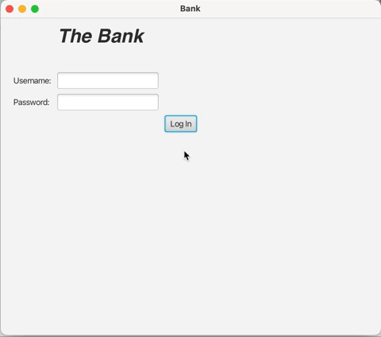
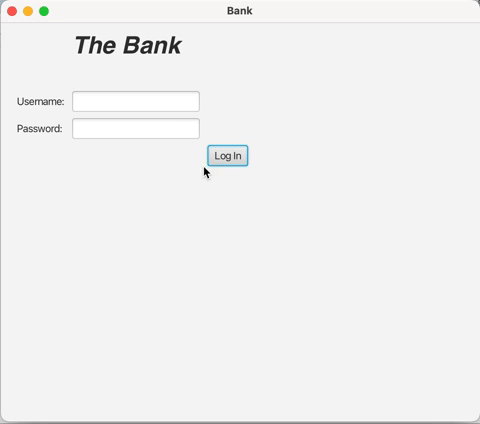
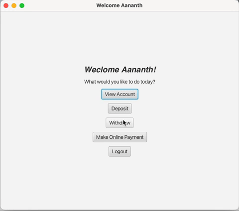
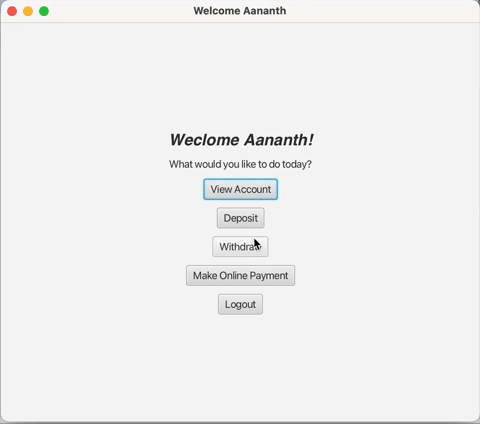

# Banking Application

## Overview
This repository contains a banking application developed with Java and JavaFX 17. The banking application simulates online banking operations with the user being able to log in and out of accounts. For this application there are two accounts a user can sign into: Manager and Customer.

This project was developed for an Object-Oriented Design and Analysis course. One of the objectives was to implement the State Design pattern. This implementation is explained, in depth, in the features section. The functionality of this banking system was programmed in Java. An interactive GUI was made using JavaFX. The project was created entirely on Apache NetBeans 17 IDE.

## Features
### Manager
A manager account could do the following: create customer or delete customer.

Here is a quick preview of the Manager account:  
 

### Customer
A customer account could check their balance and in addition, make the following transactios: 

Depositing money 
 

Withdawing money 
 

Making online payments  
 

The State Design pattern is implemented by changing the account "level" depending on its balance. The levels of the account are explained as follows:

* Silver Account: Balance < $10000 - Online purchases over $50 have a $20 fee
* Gold Account: $10000 <= Balance < $20000 - Online purchases over $50 have a $10 fee
* Platinum Account: $20000 <= Balance - Online purchases have no fee

## Usage
This project was created on Apache NetBeans 17. As a result, this program may not execute as expected on other IDE's. 

1. To use the GUI, make sure to have Apache Netbeans 17 downloaded.

2. Make sure the platform is set to JDK 17 or later. This program was created using JavaFX 17

3. Run the file "GUI.java"

## Improvements
Future improvements to this project include but are not limited to:

1. Increase felxibility of application to be used on different IDE's

2. Adding colour and other visually pleasing elements to the application

3. Connect the application to a database for multiple users rather than storing information in created text files

4. Add more functionality to Manager and Customer accounts

